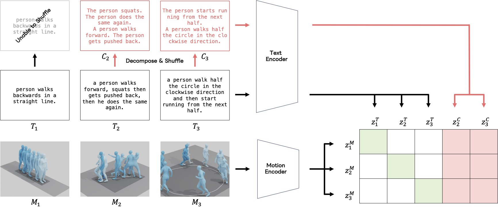

#  Official Implementation of Chronologically Accurate Retrieval for Temporal Grounding of Motion-Language Models (ECCV 2024)

Official implementation of the paper: Chronologically Accurate Retrieval for Temporal Grounding of Motion-Language Models.

## Framework



## Requirements

Python 3.10

Pytorch 2.0.0

### Recommended: Using Poetry

```bash
poetry install
```

### Using Conda
```bash
conda create -n car python=3.11
conda activate car
conda install pytorch==2.0.0 torchvision==0.15.1 torchaudio==2.0.1 pytorch-cuda=11.8 -c pytorch -c nvidia
pip install -r requirements.txt
```

## Data Preparation
Please follow the descriptions in the [TMR](https://github.com/Mathux/TMR) repository to prepare the datasets.
Then, place them as follows.
Note that events have to be generated as described in the paper. Please prepare a json file for each motion, with "events" indicating the decomposed events. You can download the event descriptions from [here](https://drive.google.com/file/d/14FUVBotloBLDbtpvlShQTyX5A4TogLL4/view?usp=drive_link).
Please view "datasets/datasets.py" for how the files are handled.


```
ChronAccRet
│   README.md
│   requirements.txt
|   ...
|
└───config
└───datasets
└───...
└───stats
    └───humanml3d
        └───guoh3dfeats #place the statistics here
            └───mean.pt
                std.pt
└───data
    └───humanml3d
        │   annotations.json
        └───event_texts  #texts for events (the json files described above)
        └───motions
        └───sent_embeddings #embeddings of sentences
        └───splits
        └───motions
            └─── guoh3dfeats #processed pose data
            └─── pose_data
```      
  
## Training
Modify the config file in configs folder. The default is set to train the model with DistilBERT.
Change the line before the main() function accordingly, then train:

```bash
python train.py
```

We prepared four variations of our method based on DistilBert: Original TMR in ''event > event'' (train_bert_orig.yaml) and ''orig > event'' (train_bert_orig_o2e.yaml), our version in ''event > event'' (train_bert_neg.yaml) and ''orig > event'' (train_bert_neg_o2e.yaml). The pretrained weights can be downloaded from [here](https://huggingface.co/line-corporation/ChronAccRet/). The trained models should be placed in ```output``` directory. Please use the config file as guideline to train other variants. To tune the language model, set the `train_text_encoder` option to True.

## Evaluation
Change the line before the main() function accordingly, then evaluate using conventional metrics:
```bash
python evaluate.py
```

For CAR accuracy:
```bash
python retrieval_shuffle.py
```

For motion-to-text retrieval with the shuffled texts:
```bash
python evaluate_negative.py
```

## Acknowledgement
Some parts of our code are based on [TMR](https://github.com/Mathux/TMR).


## Citation
```bibtex
@InProceedings{Fujiwara_2024_ECCV, 
	author = {Kent Fujiwara and Mikihiro Tanaka and Qing Yu}, 
	title = {Chronologically Accurate Retrieval for Temporal Grounding of Motion-Language Models}, 
	booktitle = {Proc. of the European Conf. on Computer Vision (ECCV)}, 
	year = {2024}, 
}
```


## License
[Apache License 2.0](LICENSE)

Additionally, this repository contains third-party software. Refer [NOTICE.txt](NOTICE.txt) for more details and follow the terms and conditions of their use.